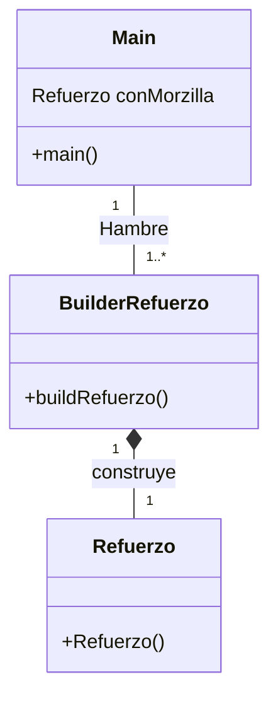

# BuilderRefuerzo

## Refuerzo Builder explicación

## Preguntas Examen

#### ¿Cual es la función del patrón builder? Pon ejemplo (que no sea Pizzas)

 Agilizar el uso del programa, tanto para desarrollador como usuario, ya sea acortando tiempos de ejecucion para el usuario, o agilizando la programacion y teste para el desarrollador.

 Es en base a la produccion de objetos.

 Lo consigue al usar parametros ya preestablecidos en la clase de la cual creara un objeto, haciendo asi uno por defecto (los mejor seria que ese fuese el mas pedido), y haciendo las modificaciones pertinentes al por defecto.

 Ejemplo: 

 En la epoca de Invierno el refuerzo mas pedido es de jamon y queso, ambos calientes, de tamaño normal, y de pan flauta.
 Seria mucha molestia especificar cada uno de esos parametros para el recepcionista para preguntar, al cliente para responder, y al desarrollador para soportar las quejas por mal codigo.
 Por lo que es mejor tener una elejida una plantilla con esos elementos bases y que luego se puede modificar el objeto creado en base a las demandas oportunas del cliente, siendo el caso de que el recepcionista le pregunte si quiere algo diferente.

## ¿Como es su Diagrama de clases de este ejemplo que has hecho? Realiza en el readme el diagrama

### Diagrama de clases

## ¿Podríamos combinarlo con el patrón Factory? Explícalo con algo de código como lo harías

 Para esto se podria tener como idea, el usar el el builder dentro del factory, ya sea metiendolo dentro de algun switch, para agilizar el cambio de idioma humano (Español, Ingles, Chino, etc..).

